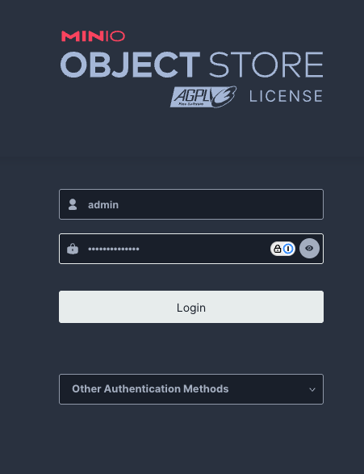

# storctl - AIStor Environment Manager

`storctl` is a command-line tool for managing demo and lab environments in cloud infrastructure or on the local host using virtual machines.
The main focus of this tool is on MinIO AIStor testing, training, and demonstration.

## Features

- Create and manage lab environments with multiple servers and volumes
- Manage DNS records with Cloudflare
- Use Lima virtual machines on macOS or Hetzner Cloud infrastructure (currently)
- Manage SSH keys to access cloud VMs
- Manage cloud resource lifecycle with TTL (Time To Live)
- Use YAML-based configuration and resource definitions similar to Kubernetes

## Installation

### Prerequisites

#### For both deployments

1. `kubectl` is installed. If it's not installed on your machine, follow these [instructions](https://kubernetes.io/docs/tasks/tools/#kubectl)

1. Krew is installed. If it's not installed, follow these [instructions](https://krew.sigs.k8s.io/docs/user-guide/setup/install/)

1. DirectPV plugin is installed. If it's not installed, follow these [instructions](https://min.io/docs/directpv/installation/#install-directpv-plugin-with-krew)

1. Helm is installed. If it's not installed on your machine, follow these [instructions](https://helm.sh/docs/intro/install/).
   On a Mac, the easiest way is to use `brew install helm`.

1. Ansible is installed. If it's not installed on your machine, follow these [instructions](https://docs.ansible.com/ansible/latest/installation_guide/intro_installation.html). On a Mac, you can simply `brew install ansible`.

#### For local deployment

Local AIStor installation uses Lima to manage virtual machines, QEMU as a virtualization engine, and `socket_vmnet` for the network.
We have to use QEMU with `socket_vmnet` shared network to allow the VMs to talk to each other and being able to access the VMs from the host.

1. Install Lima.

   ```shell
   brew install lima
   ```

1. Install QEMU

   ```shell
   brew install qemu
   ```

1. Check if you have already installed Xcode command tools (which is very likely)

   ```shell
   xcode-select -p
   ```

   Expected output:

   ```none
   /Library/Developer/CommandLineTools
   ```

   If it's not installed, run:

   ```shell
   xcode-select --install
   ```

1. Build and install the network driver for `socket_vmnet`. The full instructions and explanation is provided on the official [Lima site](https://lima-vm.io/docs/config/network/#socket_vmnet).
   Here is a short version of it:

   ```shell
   # Install socket_vmnet as root from source to /opt/socket_vmnet
   # using instructions on https://github.com/lima-vm/socket_vmnet
   # This assumes that Xcode Command Line Tools are already installed
   git clone https://github.com/lima-vm/socket_vmnet
   cd socket_vmnet
   # Change "v1.2.1" to the actual latest release in https://github.com/lima-vm/socket_vmnet/releases
   git checkout v1.2.1
   make
   sudo make PREFIX=/opt/socket_vmnet install.bin

   # Set up the sudoers file for launching socket_vmnet from Lima
   limactl sudoers >etc_sudoers.d_lima
   less etc_sudoers.d_lima  # verify that the file looks correct
   sudo install -o root etc_sudoers.d_lima /etc/sudoers.d/lima
   rm etc_sudoers.d_lima
   ```

1. Note: Lima might give you an error message about the `docker.sock` file.
   In that case, just delete the file mentioned in the error message.

#### For cloud deployment

1. Get a Hetzner Cloud account and API token. Ask the Traning team for access to the MinIO shared project.

1. Get a Cloudflare account and API token (for DNS management) from the Training team.
   You don't need it if you prefer to use your own domain.

### Using released binaries (recommended)

Download binaries for your OS/arch from the [Releases](https://github.com/pavelanni/storctl/releases) page.

### Building from source

```bash
git clone https://github.com/pavelanni/storctl
cd storctl
go build -o storctl .
# Move the resulting binary to your PATH
mv storctl $HOME/.local/bin # or any other directory in your PATH
```

## Configuration

1. Initialize the configuration:

```bash
storctl init
```

This creates a default configuration directory at `~/.storctl` with the following structure:

- `config.yaml` -- Main configuration file
- `templates/` -- Lab environment templates
- `keys/` -- SSH key storage
- `ansible/` -- for Ansible playbooks and inventory files
- `lima/` -- for Lima configs

1. Edit the configuration file at `~/.storctl/config.yaml`:

```yaml
providers:
  - name: "hetzner"
    token: "your-hetzner-token" # add your Hetzner Cloud token if you are going to use cloud installation
    location: "nbg1" # EU locations: nbd1, fsn1, hel1; US locations: ash, hil; APAC locations: sin
  - name: "lima"

dns: # this section is not used by local installation
  provider: "cloudflare"
  token: "your-cloudflare-token" # add your Cloudflare token if you're going to use cloud installation
  zone_id: "your-zone-id" # add your Cloudflare Zone ID if you're going to use cloud installation
  domain: "aistorlabs.com" # feel free to use your own domain

# this section is not used by local installation
email: "your-email@example.com"
organization: "your-organization"
owner: "your-name"
```

## Usage

### Basic Commands

```bash
# View current configuration
storctl config view

# Create a new lab environment
storctl create lab mylab --template lab.yaml

# List all labs
storctl get lab

# Get details about a specific lab
storctl get lab mylab

# Delete a lab
storctl delete lab mylab

# Create a new SSH key (you need it only for cloud installation)
storctl create key mykey

# Create a new server (usually servers are created automatically)
storctl create server myserver

# Create a new volume (usually volumes are created automatically)
storctl create volume myvolume
```

### Using resource YAML files

You can also create resources using YAML definition files. Those files use a format used by Kubernetes manifests.

```bash
storctl create -f lab.yaml
storctl create -f server.yaml
storctl create -f volume.yaml
```

### Resource templates

Example lab template:

```yaml
apiVersion: v1
kind: Lab
metadata:
  name: aistor-lab
  labels:
    project: aistor
spec:
  ttl: 24h
  provider: hetzner
  location: nbg1
  servers:
  - name: cp
    serverType: cx22
    image: ubuntu-24.04
  - name: node-01
    serverType: cx22
    image: ubuntu-24.04
volumes:
  - name: volume-01
    server: node-01
    size: 100
    automount: false
    format: xfs
```

## After AIStor installation

1. At the end of the Ansible playbook output find the location of the Kubernetes config file.
   It should include the phrase "You can use it by running: export KUBECONFIG=".
   Copy the file path and run the command mentioned above:

   ```shell
   export KUBECONFIG=$HOME/.storctl/kubeconfigs/mylab-kubeconfig
   ```

1. Check if you can see the cluster nodes:

   ```shell
   kubectl get nodes
   ```

   Expected output:

   ```none
   NAME            STATUS   ROLES                  AGE     VERSION
   mylab-cp        Ready    control-plane,master   6m55s   v1.31.5+k3s1
   mylab-node-01   Ready    <none>                 6m48s   v1.31.5+k3s1
   ```

1. Check if the AIStor pod is running:

   ```shell
   kubectl get pod -n aistor
   ```

   Expected output:

   ```none
   NAME       READY   STATUS    RESTARTS   AGE
   aistor-0   1/1     Running   0          20s
   ```


1. Check if the AIStor service has been created:

   ```shell
   kubectl get svc -n aistor
   ```

   Expected output:

   ```none
   NAME        TYPE        CLUSTER-IP     EXTERNAL-IP   PORT(S)             AGE
   aistor      ClusterIP   10.43.182.85   <none>        8444/TCP,7899/TCP   70s
   aistor-hl   ClusterIP   None           <none>        8444/TCP,7899/TCP   70s
   ```

1. Run the `port-forward` command to be able to access the cluster from the browser:

   ```shell
   kubectl port-forward -n aistor svc/aistor 8444:8444
   ```

   Expected output:

   ```none
   Forwarding from 127.0.0.1:8444 -> 8444
   Forwarding from [::1]:8444 -> 8444
   ```

   Don't close this terminal session and keep it running while configuring AIStor.

1. Open the URL: `http://localhost:8444` in the browser. You should see the first AIStor page where you should enter the license.

1. Enter the license key. If you don't have it, obtain it from your MinIO representative.

1. Create the first user that will the the cluster admin.

   

1. Create your first object store. Answer "**No**" to both questions (about drive manager and encryption).

   

   1. Configure the object store according to the cluster configuration you created.
      For example, if you have one worker node and four drives (the default `lab.yaml`), enter those parameters in the fields.
      Set the total storage to 100 GiB.

      

1. Add a user to the Object Store you just created. Click **Access** in the menu:

   

   And create the admin user. Assign the `consoleAdmin` policy to that user.

   

1. Add an an Inbound traffic configuration to access the cluster via NodePort. Click **Inbound Traffic** in the menu:

   

   Enable Direct Access. Set the port for Object API to 30001 and for Console UI to 31001.

   

1. In another terminal session (not the one running the `kubectl port-forward` command) create a new alias for the first Object Store.
   Use the credentials you give the first user. In the example below the user is `admin` and the password is `learn-by-doing`.

   ```shell
   export MC_INSECURE=true
   mc alias set aistor-first https://localhost:30001 admin learn-by-doing
   ```

1. Open this URL in your browser: `https://localhost:31001`

1. Enter your `admin` user credentials in the login form. These is the user you created in the first Object Store, NOT the first user you created after installing AIStor.

   

1. Use the Object Store console the usual way.

## Starting and stopping

If you reboot your Mac you Lima VMs will stop. You have to start them to continue using the lab.
Run this command to list all VMs:

```shell
limactl list
```

Expected output:

```none
NAME             STATUS     SSH            VMTYPE    ARCH       CPUS    MEMORY    DISK     DIR
mylab-cp         Stopped    127.0.0.1:0    qemu      aarch64    2       4GiB      40GiB    ~/.lima/mylab-cp
mylab-node-01    Stopped    127.0.0.1:0    qemu      aarch64    2       4GiB      40GiB    ~/.lima/mylab-node-01
```

Start the VMs:

```shell
limactl start mylab-cp
limactl start mylab-node-01
```

Then access your cluster as described above.

## Shell access to the nodes

You can access each Lima VM with:

```shell
limactl shell mylab-cp
```

All necessary tools, like `mc`, `warp`, `kubectl` are installed on the control plane node.
You are logged in as a normal user but you can run `sudo` to access root commands.

## Resource management

All resources support:

- Labels for organization and filtering
- TTL (Time To Live) for automatic cleanup
- Provider-specific configurations
- YAML/JSON manifest files

## Known issues

1. In multi-node configurations (with more than one worker node in the cluster) sometimes DirectPV doesn't discover
   drives on all nodes properly. Before starting using AIStor after installation, check DirectPV status with this command:

   ```shell
   kubectl directpv info
   ```

   If in the output you don't see all your nodes and drives, re-run the discovery and initialization commands:

   ```shell
   kubectl directpv discover
   kubectl directpv init drives.yaml --dangerous
   ```

   And check the status again with the `kubectl directpv info` command.

## Contributing

Contributions are welcome! Please feel free to submit a Pull Request.
