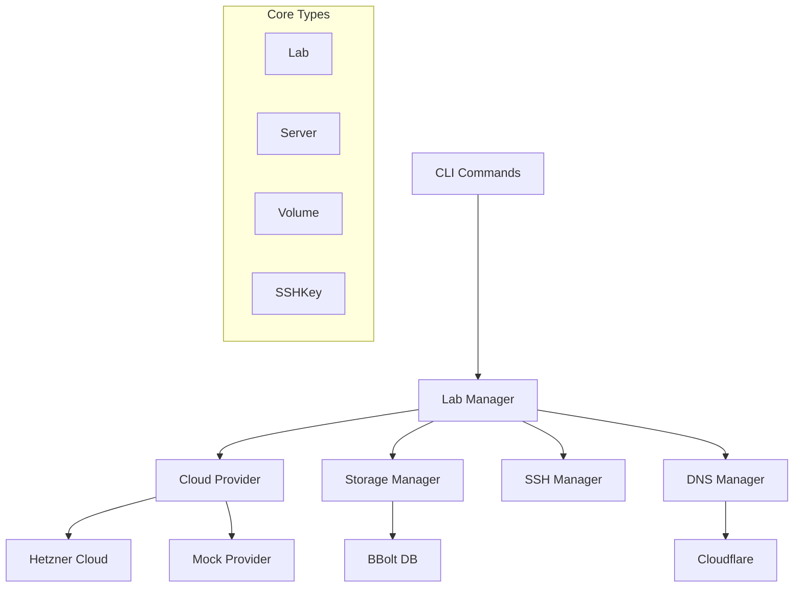

# Project overview

`storctl` is a CLI tool for managing lab environments in cloud infrastructure, primarily focused on MinIO AIStor testing and training. It follows a modular architecture with clear separation of concerns.

## Core Components

1. Command Layer (`cmd/`)

- Handles CLI commands and user interaction
- Uses Cobra for command structure
- Main commands: create, get, delete, list labs/servers/volumes

1. Lab Management (`internal/lab/`)

- Core business logic for lab environment management
- Uses BBolt for local storage
- Interfaces with cloud providers
- Manages SSH keys and server configurations

1. Provider Interface (`internal/provider/`)

- Abstract interface for cloud providers
- Currently supports Hetzner Cloud
- Mock provider for testing

1. Configuration (`internal/config/`)

- Manages application configuration
- Uses Viper for config management
- Handles cloud credentials and default settings

## Architecture diagram



## Key Types and Interfaces

### Lab Manager Interface

```go
type Manager interface {
    Create(lab *types.Lab) error
    Get(labName string) (*types.Lab, error)
    List() ([]*types.Lab, error)
    Delete(labName string, force bool) error
    SyncLabs() error
}
```

### Cloud Provider Interface

```go
type CloudProvider interface {
    CreateServer(opts options.ServerCreateOpts) (*types.Server, error)
    ListServers(opts options.ServerListOpts) ([]*types.Server, error)
    DeleteServer(name string, force bool) *types.ServerDeleteStatus
    CreateVolume(opts options.VolumeCreateOpts) (*types.Volume, error)
    ListVolumes(opts options.VolumeListOpts) ([]*types.Volume, error)
    DeleteVolume(name string, force bool) *types.VolumeDeleteStatus
    // ... more methods
}
```

## Data Flow

1. User invokes CLI command
1. Command layer validates input and creates resource objects
1. Lab Manager orchestrates the operation:
   - Interacts with cloud provider
   - Manages local storage
   - Handles SSH keys
   - Updates DNS records
1. Results are stored in BBolt DB and reflected in cloud infrastructure

## Storage

- Uses BBolt (embedded key-value store)
- Stores lab configurations and metadata
- Maintains state synchronization with cloud provider

## Configuration Management

- Uses YAML for resource definitions
- Supports templates for lab environments
- Manages cloud provider credentials
- Handles DNS configurations

This architecture provides a clean separation of concerns, making it easy to:

- Add new cloud providers
- Extend functionality
- Test components independently
- Maintain state consistency
